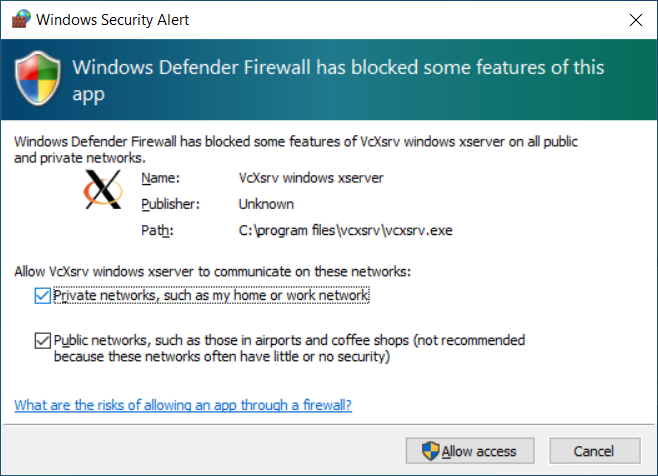
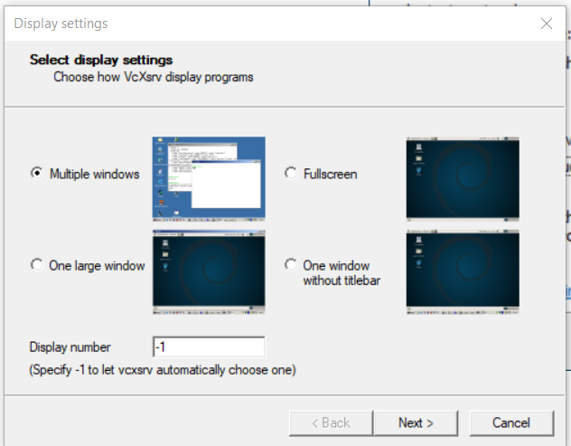
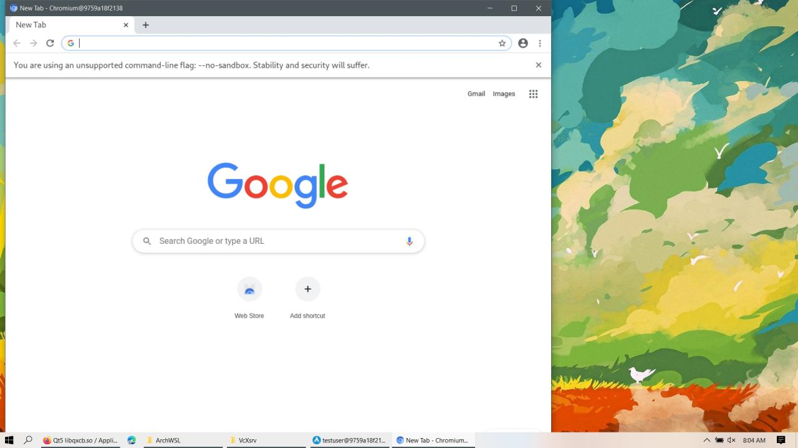
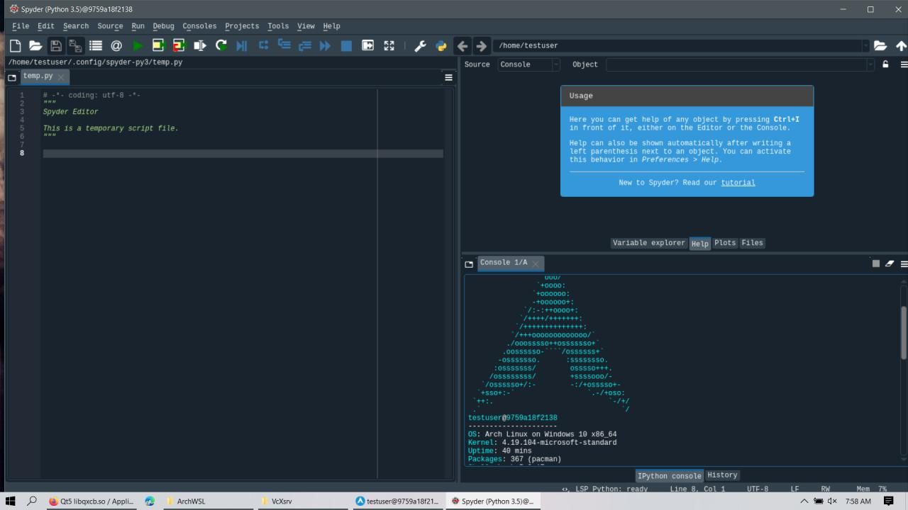

## 	

<span style="font-size:50px;">A</span>nother day, again my anaconda crashed for no reason. I decided to never use python on windows without linux vm/ docker. 

I already had my own docker image created here https://hub.docker.com/repository/docker/rushichaudhari/zipline1.3.0/  

but I wondered If I could use GUI in it, luckily I managed to do so. 


So here are the steps :-

Pre-requirements:

- Windows 10
- WSL

For now, it is necessary to install a third-party App to run the GUI Apps, but Microsoft announced on **//build 2020** that they will release soon an improvement that will not require any  third-party component to run Linux GUI Apps on Windows Desktop.


### Installing the X Server

The X server is a provider of graphics resources and keyboard/mouse events. I am using the **VcXsrv Windows X Server** that is open-source and is frequently update.

The first step is to install the third-part display manager called **VcXsrv Windows X Server** available at:

https://sourceforge.net/projects/vcxsrv/


After installing launch the **xlaunch.exe**, make sure disable access control is clicked to avoid permission error


Also allow VcxSrv in the firewall




Select multiple windows under display settings popup 




And start with no client.


## Installing Archlinux on WSL

I've used https://github.com/yuk7/ArchWSL/ for linux on WSL because arch is completely bloat free so I could install only what I need and save my space. Its installation is easy, just double-click the Arch.exe and it will be set up. For more details refer here

https://github.com/yuk7/ArchWSL/wiki/How-to-Setup


After getting Arch shell, Install docker

```sudo pacman -Syu docker```

start docker daemon

```sudo dockerd &```


The docker image I used was https://hub.docker.com/repository/docker/rushichaudhari/zipline1.3.0  which I had built to run zipline without much hassle. I will be pulling the same here. It is pretty heavy 3-4GB, you can use any light image for base os to pull from [hub.docker.com]().


```docker pull rushichaudhari/zipline1.3.0:firstpush```


The next step is to set the **DISPLAY** environment  variable on Linux to use the Windows host's IP address as WSL2 and the  Windows host are not in the same network device. It is necessary to run  the following bash command to load the correct IP address on launch:


***Inside WSL linux shell***

```export DISPLAY="`grep nameserver /etc/resolv.conf | sed 's/nameserver //'`:0"```

Running the following command, it is possible to see that the $DISPLAY environment variable now has the Windows Host’s IP set:

```echo $DISPLAY```


### Starting the docker

Get the docker Image Id

```sudo docker images``

​           


Run a new docker container using

``` sudo docker run -it  86086b792ad1  /bin/bash```


Now the current shell would be a archlinux shell which is inside a docker which is inside an archlinux wsl.

**Map the DISPLAY again like we did before so docker would point to WSL2's ip address which in turn points to Windows hosts ip address.**

****

***Inside docker linux shell***

```export DISPLAY="`grep nameserver /etc/resolv.conf | sed 's/nameserver //'`:0"```

```echo $DISPLAY```


### Installing some test applications

```
pacman -S chromium gedit python python3-pip neofetch
pacman -S qt5-base libxcb #libraries needed for spyder
pip3 install spyder
```

Some applications like chromium doesn't work on root user create a temp user if needed, switch to this user before running that application.

```
useradd -m -G wheel -s /bin/bash testuser
passwd testuser
```


Make sure that **XLaunch** is running on windows host before starting any app.

Lets start gedit

```
gedit
```


```
chromium --no-sandbox
```




```spyder3 ```




#### These all apps are not inside host windows neither inside WSL!!

Enjoy :) 

