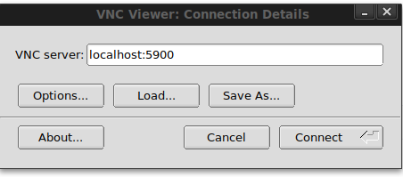

### This guide assumes you already know what is docker and docker, vncviewer installed on your system

The docker image given at [https://hub.docker.com/search?q=&type=image](https://hub.docker.com/search?q=&type=image) is a blank kali image with 0 tools. 

Let us create a light-weight custom image with the tools needed. The following are the tools which I think are commonly used in kali you can add/remove a few from that list.

```
aircrack-ng
crackmapexec
crunch
curl
dirb
dirbuster
dnsenum
dnsrecon
dnsutils
dos2unix
enum4linux
exploitdb
ftp
git
gobuster
hashcat
hping3
hydra
impacket-scripts
john
joomscan
masscan
metasploit-framework
mimikatz
nasm
ncat
netcat-traditional
nikto
nmap
patator
php
powersploit
proxychains
python-pip
python2
python3
recon-ng
responder
samba
samdump2
smbclient
smbmap
snmp
socat
sqlmap
sslscan
theharvester
vim
wafw00f
weevely
wfuzz
whois
wordlists
wpscan
```


Creating <b>Dockerfile</b>

The default password set for the VNC is 1234

```
# Dockerfile kali-light

# Official base image
FROM kalilinux/kali-rolling

# Apt
RUN apt -y update && apt -y upgrade && apt -y autoremove && apt clean

# Tools
RUN apt install aircrack-ng crackmapexec crunch curl dirb dirbuster dnsenum dnsrecon dnsutils dos2unix enum4linux exploitdb ftp git gobuster hashcat hping3 hydra impacket-scripts john joomscan masscan metasploit-framework mimikatz nasm ncat netcat-traditional nikto nmap patator php powersploit proxychains python-pip python2 python3 recon-ng responder samba samdump2 smbclient smbmap snmp socat sqlmap sslscan theharvester vim wafw00f weevely wfuzz whois wordlists wpscan -y --no-install-recommends

# DE and vncserver
RUN DEBIAN_FRONTEND=noninteractive apt install -y xfce4 xfce4-goodies x11vnc xvfb 
RUN mkdir ~/.vnc
RUN x11vnc -storepasswd 1234 ~/.vnc/passwd
COPY entrypoint.sh /entrypoint.sh
ENTRYPOINT ["/entrypoint.sh"]

# Alias
RUN echo "alias l='ls -al'" >> /root/.bashrc
RUN echo "alias nse='ls /usr/share/nmap/scripts | grep '" >> /root/.bashrc
RUN echo "alias scan-range='nmap -T5 -n -sn'" >> /root/.bashrc
RUN echo "alias http-server='python3 -m http.server 8080'" >> /root/.bashrc
RUN echo "alias php-server='php -S 127.0.0.1:8080 -t .'" >> /root/.bashrc
RUN echo "alias ftp-server='python -m pyftpdlib -u \"admin\" -P \"S3cur3d_Ftp_3rv3r\" -p 2121'" >> /root/.bashrc

# Set working directory to /root
WORKDIR /root

```


## Build your new Image

You can now create the image with command : 

`docker build -t mykali-light .`


## Creating the Host Data Volume

We need to create a shared directory to share data in the container. So whatever we paste inside ~/container-data will be available inside /root/data inside docker container.

```
mkdir ~/container-data
```

## Running docker container

```
docker run -p 5900:5900 --rm -i -t -v ~/container-data:/root/data/ mykali-light 
```


## Connect with VNC on the host machine




#### Inside the white console start xfce4 session

```
startxfce4
```


