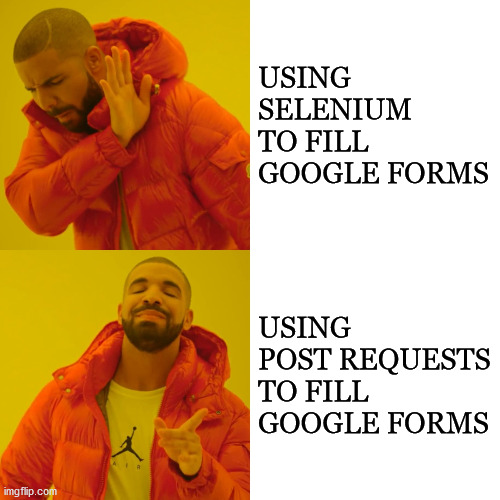
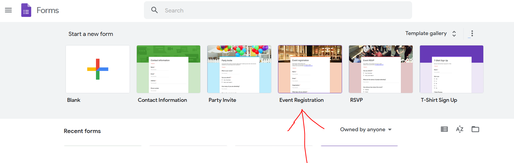
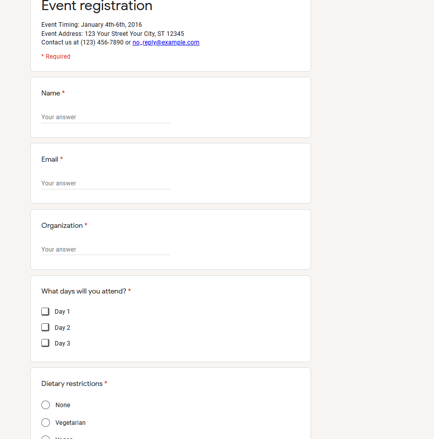
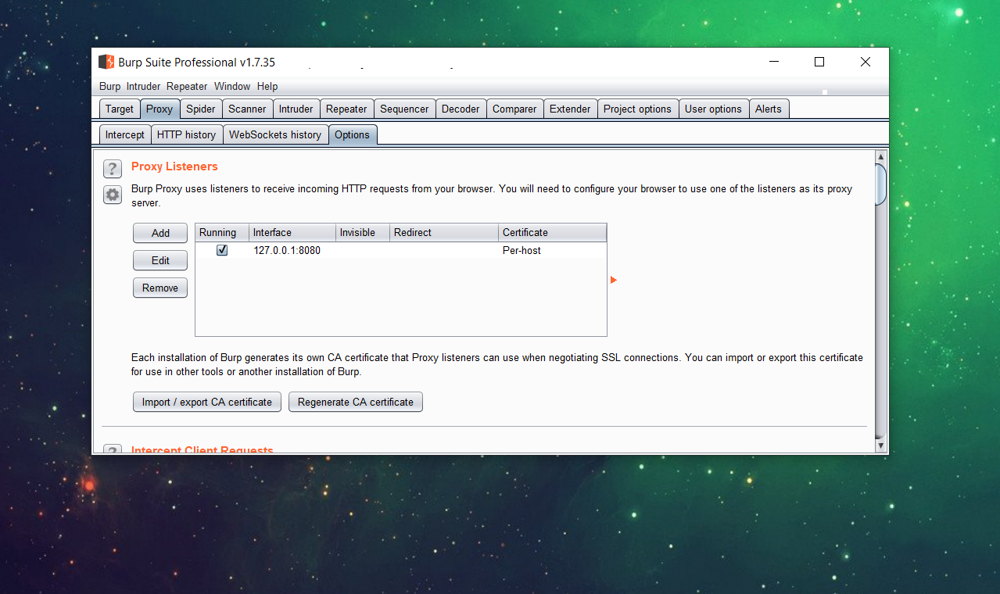
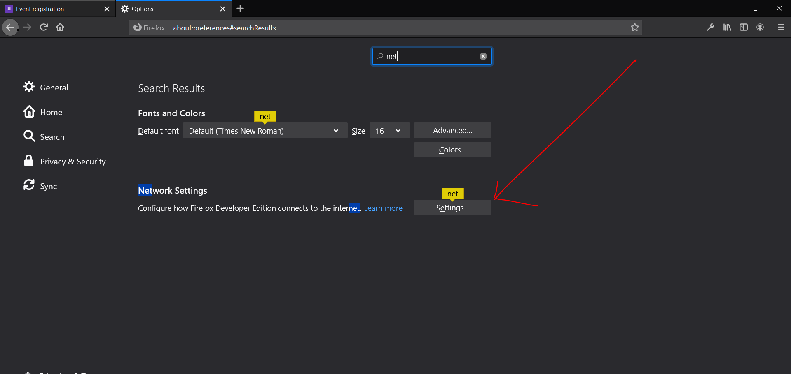
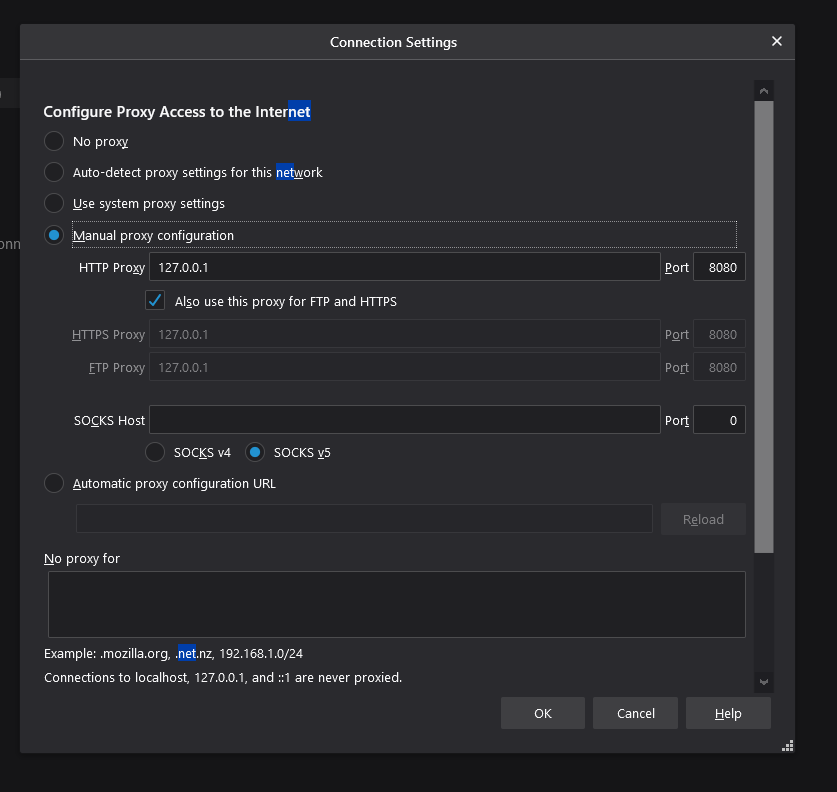

---

layout: post
title:  "Automate Google forms without selenium"
author: rushi
categories: [python, requests, selenium, google, form]
cover: "https://3fxtqy18kygf3on3bu39kh93-wpengine.netdna-ssl.com/wp-content/uploads/2019/07/selenium-webdriver-tutorial.png"
featured: false
hidden: false

---




<span style="font-size:30px;">I</span>n the previous year, I had posted a script to fill google forms using selenium, and containerizing it with docker to run it parallelly. This is an alternative way to do the same using post requests.

I had created a google form using the default template shown below.





#### Which had fields like




To get started we need to capture the request. I've used **burp suite** tool to capture, there are many alternative tools you can google. 


## Capturing Requests

#### Setting up burp

**Create a localhost proxy in burp**




**Then in the browser settings, put the proxy as localhost**






**You may refer this on how to capture request using burp**

<iframe width="917" height="516" src="https://www.youtube.com/embed/gZtuqbEE6aY" frameborder="0" allow="accelerometer; autoplay; encrypted-media; gyroscope; picture-in-picture" allowfullscreen></iframe>


## The CODE

For the URL to send request, replace the '/viewform' from the original URL when you open the form manually in browser with '/formResponse',  In my case

```{r, engine='python', count_lines}
URL = "https://docs.google.com/forms/d/e/1FAIpQLSc11NqG6fWqNn327qdb479z6QTrmC7QEwbvH7sB-CQ59iA_ZQ/formResponse"
```

Copy the raw_headers which you get from burpsuite

```python
raw_headers='''
Host: docs.google.com
User-Agent: Mozilla/5.0 (Windows NT 10.0; Win64; x64; rv:77.0) Gecko/20100101 Firefox/77.0
Accept: text/html,application/xhtml+xml,application/xml;q=0.9,image/webp,*/*;q=0.8
Accept-Language: en-US,en;q=0.5
Accept-Encoding: gzip, deflate
Referer: https://docs.google.com/forms/d/e/1FAIpQLSc11NqG6fWqNn327qdb479z6QTrmC7QEwbvH7sB-CQ59iA_ZQ/viewform?fbzx=5050709467963863140
Content-Type: application/x-www-form-urlencoded
Content-Length: 365
Origin: https://docs.google.com
Connection: close
Cookie: S=spreadsheet_forms=ptyYIUGTE-Wce1eMmds7LWc60bZe_XGHOQKjxWnzIHk; NID=204=0wAwj_KBdtmVpuWOQvMGbyhQS7w9LewGgXAnULqYY-ElcRmhGC1_LeJHUB__Fl7nRmGA89EjUK_6PDO4ihZ0fbL0mohFj5zYKpwCZ3j-DoGFtMo2gzQ0Ck9XabjFSDOGgYvjQXFVE6YuhD9SzX9XKub9zsG7o6KPKNThIYz0f5I; ANID=AHWqTUm_MzyyXf3yDhw_L2TZ3Gx9IL62BowaziQCT57iFP7NiOWn86NfU5A3FRyo
Upgrade-Insecure-Requests: 1
'''
```


Cleaning and converting of the raw_headers into a dictionary

```python
headrs= dict([[h.partition(':')[0], h.partition(':')[2].strip()] for h in raw_headers.split('/n')])

#removing cookie and blank keys
del headrs['Cookie']
del headrs['']
```


Similarly raw_data is data sent as shown in burpsuite, copy that into raw_data

```Python
raw_data='entry.2092238618=test1&entry.1556369182=test1%40gmail.com&entry.479301265=asdasd&entry.1753222212=Day+1&entry.1753222212=Day+3&entry.588393791=Vegetarian&entry.2109138769=Yes&entry.1753222212_sentinel=&entry.588393791_sentinel=&entry.2109138769_sentinel=&fvv=1&draftResponse=%5Bnull%2Cnull%2C%225050709467963863140%22%5D%0D%0A&pageHistory=0&fbzx=5050709467963863140'

```

The raw_data is [url-encoded](https://www.w3schools.com/tags/ref_urlencode.ASP), we need to url-decode it first

```Python
raw_data= urllib.parse.unquote(raw_data)
```


Cleaning and fetching the keys of raw_data

```python
raw_data=raw_data.split('&')
data={}
for x in raw_data[:-4]:
    data[x.split('=')[0]]=x.split('=')[1]

data= {k: v for k, v in data.items() if v is not ''}
print(data.keys())
```

Next we generate a custom dictionary with the keys fetched and their respective values as custom values

**Note:-** For multiple values like checkboxes we can also pass as a list like **'entry.1753222212': ['Day 1', 'Day 3']** here.

```python
data = {
        "entry.2092238618":"johnwick",
        'entry.1556369182': 'johnw@gmail.com',
        'entry.479301265': 'dheknyasorg',
        'entry.1753222212': ['Day 1', 'Day 3'],
        'entry.588393791': 'Vegan',
        'entry.2109138769': 'Yes',
    }
```


Now everything is ready, we only need to send a post request with our parameters.

```Python
# sending post request and saving response as response object 
r = requests.post(url = URL, data = data, headers=headrs) 

# status 200=success 
resp = r.status_code 
print("The ResponseL is:%s"%resp) 
```

A response would get recorded in the google form if status_code is 200.


Full code here [https://github.com/rushic24/Automating-Forms-Google-Forms/tree/master/Method2-%20Post%20Requests](https://github.com/rushic24/Automating-Forms-Google-Forms/tree/master/Method2-%20Post%20Requests)