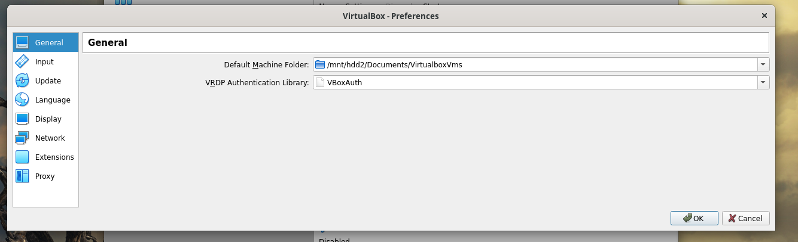
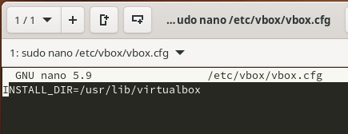

## What is Vagrant ?
https://www.janbasktraining.com/blog/vagrant-tutorial/

Install Vagrant

```
sudo pacman -S vagrant
```

```
vagrant plugin install vagrant-vbguest vagrant-share
```

**Note**: There is also vagrant libvirt plugin for qemu

```
vagrant plugin install vagrant-libvirt
```

but this doesn't work with kubeflow


Install virtualbox

```
sudo pacman -S virtualbox
```

- for the linux kernel, choose virtualbox-host-modules-arch
- for any other kernel (including linux-lts), choose virtualbox-host-dkms

Load the vbox drv module

```
sudo modprobe vboxdrv
```

Make sure to put path for Virtualbox where you have a lot of space (50GB+)



Also give vagrant config sufficient space

```
sudo export VAGRANT_HOME=/mnt/hdd2/Documents/.vagrant.d/
```

```
mkdir kubeproj && cd kubeproj
```

Initialize minikf

```
vagrant init arrikto/minikf
```

create this file #necessary for virtualbox on Arch [source](https://discuss.hashicorp.com/t/vagrant-2-2-18-osx-11-6-cannot-create-private-network/30984)



```
vagrant up --provider='virtualbox' #not libvirtd
```